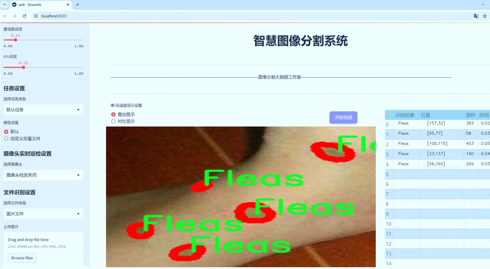
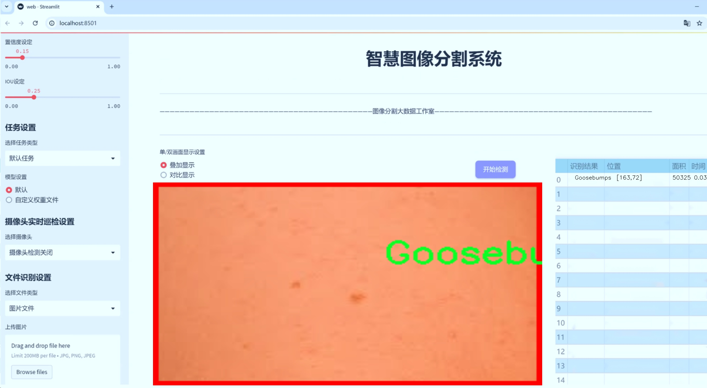
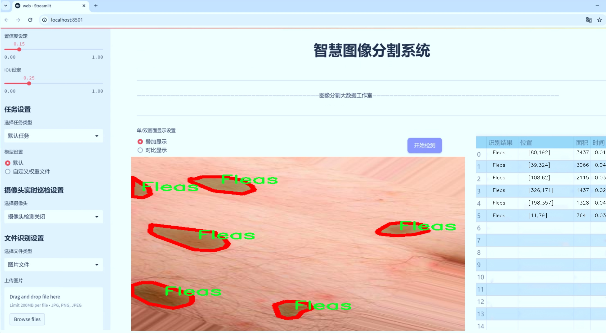
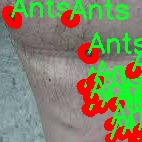
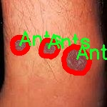
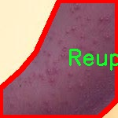
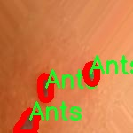
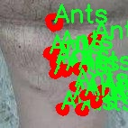

# 皮肤病图像分割系统源码＆数据集分享
 [yolov8-seg-RepHGNetV2＆yolov8-seg-C2f-RFCBAMConv等50+全套改进创新点发刊_一键训练教程_Web前端展示]

### 1.研究背景与意义

项目参考[ILSVRC ImageNet Large Scale Visual Recognition Challenge](https://gitee.com/YOLOv8_YOLOv11_Segmentation_Studio/projects)

项目来源[AAAI Global Al lnnovation Contest](https://kdocs.cn/l/cszuIiCKVNis)

研究背景与意义

随着社会经济的发展和人们生活水平的提高，皮肤病的发病率逐年上升，成为影响人们健康和生活质量的重要因素。皮肤病的种类繁多，包括虫咬、过敏反应、感染等，而其中虫咬引起的皮肤病尤为常见，涉及蚂蚁、床虱、跳蚤、蜱虫等多种昆虫的叮咬。为了有效诊断和治疗这些皮肤病，准确的图像分割技术显得尤为重要。图像分割不仅可以帮助医生更好地识别病变区域，还能为后续的治疗方案提供科学依据。

近年来，深度学习技术的迅猛发展为医学图像处理带来了新的机遇。YOLO（You Only Look Once）系列模型因其快速和高效的目标检测能力而受到广泛关注。特别是YOLOv8模型在图像处理领域的应用，展现了出色的性能和灵活性。然而，现有的YOLOv8模型在处理复杂的皮肤病图像时，仍然面临一些挑战，例如对细微特征的识别能力不足、背景干扰等问题。因此，基于改进YOLOv8的皮肤病图像分割系统的研究，具有重要的理论和实践意义。

本研究将基于一个包含1500张皮肤病图像的数据集进行深入分析。该数据集涵盖了10个不同的类别，包括蚂蚁、床虱、跳蚤、蜱虫等，这些类别的多样性为模型的训练和测试提供了丰富的样本。通过对这些图像进行实例分割，不仅可以提高对不同皮肤病的识别精度，还能为医生提供更为直观的病变区域展示，进而提高诊断效率。此外，针对每个类别的特征进行深入分析，有助于理解不同虫咬引起的皮肤病的临床表现和发展机制，为后续的医学研究提供数据支持。

在此背景下，研究基于改进YOLOv8的皮肤病图像分割系统，不仅可以推动计算机视觉技术在医学领域的应用，还能为皮肤病的早期诊断和个性化治疗提供有力支持。通过优化模型的结构和算法，提升其对复杂背景和细微特征的处理能力，能够有效提高皮肤病图像的分割精度。此外，研究成果还可为相关领域的研究者提供参考，推动皮肤病诊断技术的进步。

综上所述，基于改进YOLOv8的皮肤病图像分割系统的研究，既是对现有技术的创新与突破，也是对公共健康问题的积极回应。通过这一研究，我们期望能够为皮肤病的诊断和治疗提供更为精准的工具，进而改善患者的生活质量，推动医学影像学的发展。

### 2.图片演示







##### 注意：由于此博客编辑较早，上面“2.图片演示”和“3.视频演示”展示的系统图片或者视频可能为老版本，新版本在老版本的基础上升级如下：（实际效果以升级的新版本为准）

  （1）适配了YOLOV8的“目标检测”模型和“实例分割”模型，通过加载相应的权重（.pt）文件即可自适应加载模型。

  （2）支持“图片识别”、“视频识别”、“摄像头实时识别”三种识别模式。

  （3）支持“图片识别”、“视频识别”、“摄像头实时识别”三种识别结果保存导出，解决手动导出（容易卡顿出现爆内存）存在的问题，识别完自动保存结果并导出到tempDir中。

  （4）支持Web前端系统中的标题、背景图等自定义修改，后面提供修改教程。

  另外本项目提供训练的数据集和训练教程,暂不提供权重文件（best.pt）,需要您按照教程进行训练后实现图片演示和Web前端界面演示的效果。

### 3.视频演示

[3.1 视频演示](https://www.bilibili.com/video/BV1rvy8YqELP/)

### 4.数据集信息展示

##### 4.1 本项目数据集详细数据（类别数＆类别名）

nc: 10
names: ['Ants', 'Bed Bugs', 'Chiggers', 'Fleas', 'Goosebumps', 'Mosquito', 'None', 'Reupload', 'Spider', 'Tick']


##### 4.2 本项目数据集信息介绍

数据集信息展示

在本研究中，我们使用了名为“Bug Bite”的数据集，以改进YOLOv8-seg模型在皮肤病图像分割任务中的表现。该数据集专注于皮肤病相关的昆虫叮咬和皮肤反应，包含了多种常见的昆虫种类及其引起的皮肤症状。这一数据集的构建旨在为研究人员和开发者提供一个高质量的训练基础，以便于更好地识别和分割与昆虫叮咬相关的皮肤病变，从而提升临床诊断的准确性和效率。

“Bug Bite”数据集共包含10个类别，涵盖了多种与皮肤病相关的昆虫及其引起的反应。这些类别包括“Ants”（蚂蚁）、“Bed Bugs”（床虱）、“Chiggers”（虫咬）、“Fleas”（跳蚤）、“Goosebumps”（鸡皮疙瘩）、“Mosquito”（蚊子）、“None”（无）、“Reupload”（重新上传）、“Spider”（蜘蛛）和“Tick”（蜱虫）。每个类别都代表了特定的昆虫叮咬或皮肤反应，数据集中的图像均经过精心标注，以确保训练模型时的高准确性。

在数据集的构建过程中，研究团队收集了大量真实场景下的皮肤病图像，这些图像不仅包括了不同种类昆虫叮咬的特征，还展示了各种皮肤反应的多样性。通过多样化的图像来源，数据集有效地覆盖了不同肤色、不同年龄段和不同性别的个体，确保了模型训练的全面性和泛化能力。此外，数据集中的图像质量经过严格筛选，确保每张图像都具备良好的清晰度和细节，以便于模型在训练过程中能够提取到有用的特征。

为了提高模型的鲁棒性和准确性，数据集还包含了一些“None”类别的图像，这些图像展示了没有昆虫叮咬或皮肤反应的情况。这一类别的引入有助于模型学习区分正常皮肤与受影响皮肤之间的差异，从而减少误报率，提高分割的精确度。

在数据集的使用过程中，我们将采用数据增强技术，以进一步丰富训练样本的多样性。这包括旋转、缩放、翻转等操作，旨在模拟不同的拍摄角度和环境条件，使得模型在实际应用中能够更好地适应各种复杂场景。

总之，“Bug Bite”数据集为改进YOLOv8-seg的皮肤病图像分割系统提供了坚实的基础。通过对昆虫叮咬及其引起的皮肤反应的全面覆盖，数据集不仅增强了模型的学习能力，还为后续的临床应用奠定了基础。随着该系统的不断优化和完善，我们期待能够为皮肤病的早期诊断和治疗提供更为精准的支持，最终提升患者的生活质量。











### 5.全套项目环境部署视频教程（零基础手把手教学）

[5.1 环境部署教程链接（零基础手把手教学）](https://www.bilibili.com/video/BV1jG4Ve4E9t/?vd_source=bc9aec86d164b67a7004b996143742dc)


[5.2 安装Python虚拟环境创建和依赖库安装视频教程链接（零基础手把手教学）](https://www.bilibili.com/video/BV1nA4VeYEze/?vd_source=bc9aec86d164b67a7004b996143742dc)

### 6.手把手YOLOV8-seg训练视频教程（零基础小白有手就能学会）

[6.1 手把手YOLOV8-seg训练视频教程（零基础小白有手就能学会）](https://www.bilibili.com/video/BV1cA4VeYETe/?vd_source=bc9aec86d164b67a7004b996143742dc)


按照上面的训练视频教程链接加载项目提供的数据集，运行train.py即可开始训练



     Epoch   gpu_mem       box       obj       cls    labels  img_size
     1/200     0G   0.01576   0.01955  0.007536        22      1280: 100%|██████████| 849/849 [14:42<00:00,  1.04s/it]
               Class     Images     Labels          P          R     mAP@.5 mAP@.5:.95: 100%|██████████| 213/213 [01:14<00:00,  2.87it/s]
                 all       3395      17314      0.994      0.957      0.0957      0.0843

     Epoch   gpu_mem       box       obj       cls    labels  img_size
     2/200     0G   0.01578   0.01923  0.007006        22      1280: 100%|██████████| 849/849 [14:44<00:00,  1.04s/it]
               Class     Images     Labels          P          R     mAP@.5 mAP@.5:.95: 100%|██████████| 213/213 [01:12<00:00,  2.95it/s]
                 all       3395      17314      0.996      0.956      0.0957      0.0845

     Epoch   gpu_mem       box       obj       cls    labels  img_size
     3/200     0G   0.01561    0.0191  0.006895        27      1280: 100%|██████████| 849/849 [10:56<00:00,  1.29it/s]
               Class     Images     Labels          P          R     mAP@.5 mAP@.5:.95: 100%|███████   | 187/213 [00:52<00:00,  4.04it/s]
                 all       3395      17314      0.996      0.957      0.0957      0.0845


### 7.50+种全套YOLOV8-seg创新点代码加载调参视频教程（一键加载写好的改进模型的配置文件）

[7.1 50+种全套YOLOV8-seg创新点代码加载调参视频教程（一键加载写好的改进模型的配置文件）](https://www.bilibili.com/video/BV1Hw4VePEXv/?vd_source=bc9aec86d164b67a7004b996143742dc)

### 8.YOLOV8-seg图像分割算法原理

原始YOLOv8-seg算法原理

YOLOv8-seg算法是YOLO系列中的最新进展，由Glenn-Jocher提出，旨在在目标检测的基础上，进一步拓展到实例分割任务。作为YOLOv3和YOLOv5的继承者，YOLOv8-seg不仅保留了前者的优良特性，还在多个方面进行了创新和改进，使其在处理复杂视觉任务时表现得更加出色。

首先，YOLOv8-seg在数据预处理方面延续了YOLOv5的策略，采用了一系列增强手段以提升模型的鲁棒性和泛化能力。这些增强手段包括马赛克增强、混合增强、空间扰动和颜色扰动等。这些技术的应用使得模型在训练过程中能够接触到更为多样化的样本，从而提高了其对不同场景和物体的适应能力。尤其是在实例分割任务中，数据的多样性对于模型的性能至关重要，YOLOv8-seg通过这些预处理手段有效地增强了训练数据的多样性，进而提升了分割精度。

在骨干网络结构方面，YOLOv8-seg对YOLOv5的设计进行了改进，采用了C2f模块替代了原有的C3模块。C2f模块通过引入更多的分支，丰富了梯度回传时的支流，使得特征提取过程更加高效。与YOLOv5的C3模块相比，C2f模块在保持模型复杂度的同时，增强了特征的表达能力。这种设计使得YOLOv8-seg在处理细粒度特征时，能够更好地捕捉到物体的边界和细节，从而在实例分割任务中取得更好的效果。

YOLOv8-seg还采用了FPN-PAN结构来构建特征金字塔，这一结构使得多尺度信息能够得到充分融合。FPN（特征金字塔网络）和PAN（路径聚合网络）的结合，不仅增强了特征的多尺度表达能力，还提升了模型对不同尺寸物体的检测和分割能力。YOLOv8-seg在这一结构中对C3模块进行了替换，使用C2f模块来增强特征的传递和融合，进一步提升了模型的性能。

在检测头的设计上，YOLOv8-seg引入了解耦头结构，这一结构的核心在于将分类和定位任务分开处理。通过设置两条并行的分支，分别提取类别特征和位置特征，YOLOv8-seg能够更精确地完成目标检测和实例分割任务。这种解耦的设计使得模型在进行类别判断和位置回归时，能够独立优化，避免了耦合结构可能带来的信息干扰，从而提高了整体的检测精度。

在标签分配策略方面，YOLOv8-seg采用了动态标签分配策略，解决了正负样本匹配的多尺度分配问题。与YOLOX使用的SimOTA策略不同，YOLOv8-seg借鉴了YOLOv6的TOOD策略，简化了标签分配的过程。通过只使用目标框和目标分数，YOLOv8-seg能够更高效地进行样本的选择和训练，减少了对数据集质量的依赖。其损失函数主要包括类别损失和位置损失，其中类别损失采用了Varifocal Loss（VFL），位置损失则结合了CIoULoss与DFLLoss。这种损失函数的设计，使得模型在训练过程中能够更加关注高质量的正样本，同时降低负样本对损失的影响，从而提高了模型的学习效率。

YOLOv8-seg的整体网络结构在设计上充分考虑了实例分割任务的特点，特别是在处理复杂场景和细节丰富的物体时，模型的表现尤为突出。通过对特征提取、特征融合和检测头的全面优化，YOLOv8-seg不仅在目标检测上取得了优异的成绩，更在实例分割任务中展现出了强大的能力。

综上所述，YOLOv8-seg算法在多个方面进行了创新和改进，使其在目标检测和实例分割任务中均表现出色。通过引入先进的模块设计、优化的损失函数和高效的数据预处理策略，YOLOv8-seg为计算机视觉领域提供了一种强大的工具，能够应对各种复杂的视觉任务。随着YOLOv8-seg的不断发展和应用，未来在智能监控、自动驾驶、医疗影像等领域，预计将发挥更加重要的作用。


### 9.系统功能展示（检测对象为举例，实际内容以本项目数据集为准）

图9.1.系统支持检测结果表格显示

  图9.2.系统支持置信度和IOU阈值手动调节

  图9.3.系统支持自定义加载权重文件best.pt(需要你通过步骤5中训练获得)

  图9.4.系统支持摄像头实时识别

  图9.5.系统支持图片识别

  图9.6.系统支持视频识别

  图9.7.系统支持识别结果文件自动保存

  图9.8.系统支持Excel导出检测结果数据


### 10.50+种全套YOLOV8-seg创新点原理讲解（非科班也可以轻松写刊发刊，V11版本正在科研待更新）

#### 10.1 由于篇幅限制，每个创新点的具体原理讲解就不一一展开，具体见下列网址中的创新点对应子项目的技术原理博客网址【Blog】：


[10.1 50+种全套YOLOV8-seg创新点原理讲解链接](https://gitee.com/qunmasj/good)

#### 10.2 部分改进模块原理讲解(完整的改进原理见上图和技术博客链接)【如果此小节的图加载失败可以通过CSDN或者Github搜索该博客的标题访问原始博客，原始博客图片显示正常】
### FasterNet简介
神经网络在图像分类、检测和分割等各种计算机视觉任务中经历了快速发展。尽管其令人印象深刻的性能为许多应用程序提供了动力，但一个巨大的趋势是追求具有低延迟和高吞吐量的快速神经网络，以获得良好的用户体验、即时响应和安全原因等。

如何快速？研究人员和从业者不需要更昂贵的计算设备，而是倾向于设计具有成本效益的快速神经网络，降低计算复杂度，主要以浮点运算（FLOPs）的数量来衡量。

MobileNet、ShuffleNet和GhostNet等利用深度卷积（DWConv）和/或组卷积（GConv）来提取空间特征。然而，在减少FLOPs的过程中，算子经常会受到内存访问增加的副作用的影响。MicroNet进一步分解和稀疏网络，将其FLOPs推至极低水平。尽管这种方法在FLOPs方面有所改进，但其碎片计算效率很低。此外，上述网络通常伴随着额外的数据操作，如级联、Shuffle和池化，这些操作的运行时间对于小型模型来说往往很重要。

除了上述纯卷积神经网络（CNNs）之外，人们对使视觉Transformer（ViTs）和多层感知器（MLP）架构更小更快也越来越感兴趣。例如，MobileViT和MobileFormer通过将DWConv与改进的注意力机制相结合，降低了计算复杂性。然而，它们仍然受到DWConv的上述问题的困扰，并且还需要修改的注意力机制的专用硬件支持。使用先进但耗时的标准化和激活层也可能限制其在设备上的速度。

所有这些问题一起导致了以下问题：这些“快速”的神经网络真的很快吗？为了回答这个问题，作者检查了延迟和FLOPs之间的关系，这由


其中FLOPS是每秒浮点运算的缩写，作为有效计算速度的度量。虽然有许多减少FLOPs的尝试，但都很少考虑同时优化FLOPs以实现真正的低延迟。为了更好地理解这种情况，作者比较了Intel CPU上典型神经网络的FLOPS。


图中的结果表明，许多现有神经网络的FLOPS较低，其FLOPS通常低于流行的ResNet50。由于FLOPS如此之低，这些“快速”的神经网络实际上不够快。它们的FLOPs减少不能转化为延迟的确切减少量。在某些情况下，没有任何改善，甚至会导致更糟的延迟。例如，CycleMLP-B1具有ResNet50的一半FLOPs，但运行速度较慢（即CycleMLPB1与ResNet50:111.9ms与69.4ms）。

请注意，FLOPs与延迟之间的差异在之前的工作中也已被注意到，但由于它们采用了DWConv/GConv和具有低FLOPs的各种数据处理，因此部分问题仍未解决。人们认为没有更好的选择。

该博客提供的方案通过开发一种简单、快速、有效的运算符来消除这种差异，该运算符可以在减少FLOPs的情况下保持高FLOPS。

具体来说，作者重新审视了现有的操作符，特别是DWConv的计算速度——FLOPS。作者发现导致低FLOPS问题的主要原因是频繁的内存访问。然后，作者提出了PConv作为一种竞争性替代方案，它减少了计算冗余以及内存访问的数量。

图1说明了PConv的设计。它利用了特征图中的冗余，并系统地仅在一部分输入通道上应用规则卷积（Conv），而不影响其余通道。本质上，PConv的FLOPs低于常规Conv，而FLOPs高于DWConv/GConv。换句话说，PConv更好地利用了设备上的计算能力。PConv在提取空间特征方面也很有效，这在本文后面的实验中得到了验证。

作者进一步引入PConv设计了FasterNet作为一个在各种设备上运行速度非常快的新网络家族。特别是，FasterNet在分类、检测和分割任务方面实现了最先进的性能，同时具有更低的延迟和更高的吞吐量。例如，在GPU、CPU和ARM处理器上，小模型FasterNet-T0分别比MobileVitXXS快3.1倍、3.1倍和2.5倍，而在ImageNet-1k上的准确率高2.9%。大模型FasterNet-L实现了83.5%的Top-1精度，与Swin-B不相上下，同时在GPU上提供了49%的高吞吐量，在CPU上节省了42%的计算时间。

总之，贡献如下：

指出了实现更高FLOPS的重要性，而不仅仅是为了更快的神经网络而减少FLOPs。

引入了一种简单但快速且有效的卷积PConv，它很有可能取代现有的选择DWConv。

推出FasterNet，它在GPU、CPU和ARM处理器等多种设备上运行良好且普遍快速。

对各种任务进行了广泛的实验，并验证了PConv和FasterNet的高速性和有效性。

### Conv和FasterNet的设计
#### 原理

DWConv是Conv的一种流行变体，已被广泛用作许多神经网络的关键构建块。对于输入，DWConv应用个滤波器来计算输出。如图（b）所示，每个滤波器在一个输入通道上进行空间滑动，并对一个输出通道做出贡献。

与具有的FLOPs常规Conv相比，这种深度计算使得DWConv仅仅具有的FLOPs。虽然在减少FLOPs方面有效，但DWConv（通常后跟逐点卷积或PWConv）不能简单地用于替换常规Conv，因为它会导致严重的精度下降。因此，在实践中，DWConv的通道数（或网络宽度）增加到＞以补偿精度下降，例如，倒置残差块中的DWConv宽度扩展了6倍。然而，这会导致更高的内存访问，这会造成不可忽略的延迟，并降低总体计算速度，尤其是对于I/O绑定设备。特别是，内存访问的数量现在上升到


它比一个常规的Conv的值要高，即，


注意，内存访问花费在I/O操作上，这被认为已经是最小的成本，很难进一步优化。

#### PConv作为一个基本的算子


在下面演示了通过利用特征图的冗余度可以进一步优化成本。如图所示，特征图在不同通道之间具有高度相似性。许多其他著作也涵盖了这种冗余，但很少有人以简单而有效的方式充分利用它。


具体而言，作者提出了一种简单的PConv，以同时减少计算冗余和内存访问。图4中的左下角说明了PConv的工作原理。它只需在输入通道的一部分上应用常规Conv进行空间特征提取，并保持其余通道不变。对于连续或规则的内存访问，将第一个或最后一个连续的通道视为整个特征图的代表进行计算。在不丧失一般性的情况下认为输入和输出特征图具有相同数量的通道。因此，PConv的FLOPs仅


对于典型的r＝1/4 ，PConv的FLOPs只有常规Conv的1/16。此外，PConv的内存访问量较小，即：


对于r＝1/4，其仅为常规Conv的1/4。

由于只有通道用于空间特征提取，人们可能会问是否可以简单地移除剩余的（c−）通道？如果是这样，PConv将退化为具有较少通道的常规Conv，这偏离了减少冗余的目标。

请注意，保持其余通道不变，而不是从特征图中删除它们。这是因为它们对后续PWConv层有用，PWConv允许特征信息流经所有通道。

#### PConv之后是PWConv


为了充分有效地利用来自所有通道的信息，进一步将逐点卷积（PWConv）附加到PConv。它们在输入特征图上的有效感受野看起来像一个T形Conv，与均匀处理补丁的常规Conv相比，它更专注于中心位置，如图5所示。为了证明这个T形感受野的合理性，首先通过计算位置的Frobenius范数来评估每个位置的重要性。


假设，如果一个职位比其他职位具有更大的Frobenius范数，则该职位往往更重要。对于正则Conv滤波器，位置处的Frobenius范数由计算，其中。


一个显著位置是具有最大Frobenius范数的位置。然后，在预训练的ResNet18中集体检查每个过滤器，找出它们的显著位置，并绘制显著位置的直方图。图6中的结果表明，中心位置是过滤器中最常见的突出位置。换句话说，中心位置的权重比周围的更重。这与集中于中心位置的T形计算一致。

虽然T形卷积可以直接用于高效计算，但作者表明，将T形卷积分解为PConv和PWConv更好，因为该分解利用了滤波器间冗余并进一步节省了FLOPs。对于相同的输入和输出，T形Conv的FLOPs可以计算为:


它高于PConv和PWConv的流量，即：


其中和（例如，当时）。此外，可以很容易地利用常规Conv进行两步实现。

# FasterNet作为Backbone
鉴于新型PConv和现成的PWConv作为主要的算子，进一步提出FasterNet，这是一个新的神经网络家族，运行速度非常快，对许多视觉任务非常有效。目标是使体系结构尽可能简单，使其总体上对硬件友好。


在图中展示了整体架构。它有4个层次级，每个层次级前面都有一个嵌入层（步长为4的常规4×4卷积）或一个合并层（步长为2的常规2×2卷积），用于空间下采样和通道数量扩展。每个阶段都有一堆FasterNet块。作者观察到，最后两个阶段中的块消耗更少的内存访问，并且倾向于具有更高的FLOPS，如表1中的经验验证。因此，放置了更多FasterNet块，并相应地将更多计算分配给最后两个阶段。每个FasterNet块有一个PConv层，后跟2个PWConv（或Conv 1×1）层。它们一起显示为倒置残差块，其中中间层具有扩展的通道数量，并且放置了Shorcut以重用输入特征。

除了上述算子，标准化和激活层对于高性能神经网络也是不可或缺的。然而，许多先前的工作在整个网络中过度使用这些层，这可能会限制特征多样性，从而损害性能。它还可以降低整体计算速度。相比之下，只将它们放在每个中间PWConv之后，以保持特征多样性并实现较低的延迟。

此外，使用批次归一化（BN）代替其他替代方法。BN的优点是，它可以合并到其相邻的Conv层中，以便更快地进行推断，同时与其他层一样有效。对于激活层，根据经验选择了GELU用于较小的FasterNet变体，而ReLU用于较大的FasterNet变体，同时考虑了运行时间和有效性。最后三个层，即全局平均池化、卷积1×1和全连接层，一起用于特征转换和分类。

为了在不同的计算预算下提供广泛的应用，提供FasterNet的Tiny模型、Small模型、Medium模型和Big模型变体，分别称为FasterNetT0/1/2、FasterNet-S、FasterNet-M和FasterNet-L。它们具有相似的结构，但深度和宽度不同。

架构规范如下：


### 11.项目核心源码讲解（再也不用担心看不懂代码逻辑）

#### 11.1 ultralytics\utils\instance.py

以下是对代码的核心部分进行的分析和详细中文注释：

```python
# Ultralytics YOLO 🚀, AGPL-3.0 license

from collections import abc
from itertools import repeat
from numbers import Number
from typing import List
import numpy as np

# 定义一个函数，用于将输入转换为元组形式
def _ntuple(n):
    """从 PyTorch 内部实现中提取的函数。"""
    def parse(x):
        """解析边界框格式，支持 XYWH 和 LTWH。"""
        return x if isinstance(x, abc.Iterable) else tuple(repeat(x, n))
    return parse

# 将输入转换为 2 元组或 4 元组
to_2tuple = _ntuple(2)
to_4tuple = _ntuple(4)

# 定义边界框格式
_formats = ['xyxy', 'xywh', 'ltwh']

class Bboxes:
    """
    处理边界框的类，支持多种格式（'xyxy', 'xywh', 'ltwh'）。
    """

    def __init__(self, bboxes, format='xyxy') -> None:
        """初始化 Bboxes 类，接收边界框数据和格式。"""
        assert format in _formats, f'无效的边界框格式: {format}, 必须是 {_formats} 中的一种'
        bboxes = bboxes[None, :] if bboxes.ndim == 1 else bboxes  # 如果是一维数组，转为二维
        assert bboxes.ndim == 2
        assert bboxes.shape[1] == 4  # 确保每个边界框有四个坐标
        self.bboxes = bboxes
        self.format = format

    def convert(self, format):
        """将边界框格式从一种类型转换为另一种。"""
        assert format in _formats, f'无效的边界框格式: {format}, 必须是 {_formats} 中的一种'
        if self.format == format:
            return  # 如果格式相同，则不需要转换
        # 根据当前格式和目标格式选择转换函数
        func = {
            'xyxy': xyxy2xywh if format == 'xywh' else xyxy2ltwh,
            'xywh': xywh2xyxy if format == 'xyxy' else xywh2ltwh,
            'ltwh': ltwh2xyxy if format == 'xyxy' else ltwh2xywh
        }[self.format]
        self.bboxes = func(self.bboxes)  # 执行转换
        self.format = format  # 更新格式

    def areas(self):
        """返回每个边界框的面积。"""
        self.convert('xyxy')  # 转换为 xyxy 格式以计算面积
        return (self.bboxes[:, 2] - self.bboxes[:, 0]) * (self.bboxes[:, 3] - self.bboxes[:, 1])  # 计算面积

    def mul(self, scale):
        """按比例缩放边界框坐标。"""
        if isinstance(scale, Number):
            scale = to_4tuple(scale)  # 转换为 4 元组
        assert isinstance(scale, (tuple, list)) and len(scale) == 4
        self.bboxes[:, 0] *= scale[0]  # 左上角 x
        self.bboxes[:, 1] *= scale[1]  # 左上角 y
        self.bboxes[:, 2] *= scale[2]  # 右下角 x
        self.bboxes[:, 3] *= scale[3]  # 右下角 y

    def add(self, offset):
        """对边界框坐标添加偏移量。"""
        if isinstance(offset, Number):
            offset = to_4tuple(offset)  # 转换为 4 元组
        assert isinstance(offset, (tuple, list)) and len(offset) == 4
        self.bboxes[:, 0] += offset[0]  # 左上角 x
        self.bboxes[:, 1] += offset[1]  # 左上角 y
        self.bboxes[:, 2] += offset[2]  # 右下角 x
        self.bboxes[:, 3] += offset[3]  # 右下角 y

    def __len__(self):
        """返回边界框的数量。"""
        return len(self.bboxes)

    @classmethod
    def concatenate(cls, boxes_list: List['Bboxes'], axis=0) -> 'Bboxes':
        """
        将多个 Bboxes 对象连接成一个新的 Bboxes 对象。
        """
        assert isinstance(boxes_list, (list, tuple)) and all(isinstance(box, Bboxes) for box in boxes_list)
        if not boxes_list:
            return cls(np.empty(0))  # 返回空的 Bboxes 对象
        return cls(np.concatenate([b.bboxes for b in boxes_list], axis=axis))  # 连接边界框

class Instances:
    """
    包含图像中检测到的对象的边界框、分段和关键点的容器。
    """

    def __init__(self, bboxes, segments=None, keypoints=None, bbox_format='xywh', normalized=True) -> None:
        """初始化 Instances 对象。"""
        self._bboxes = Bboxes(bboxes=bboxes, format=bbox_format)  # 创建 Bboxes 对象
        self.keypoints = keypoints
        self.normalized = normalized
        # 处理分段数据
        if segments is None:
            segments = []
        if len(segments) > 0:
            segments = resample_segments(segments)  # 重新采样分段
            segments = np.stack(segments, axis=0)  # 堆叠分段
        else:
            segments = np.zeros((0, 1000, 2), dtype=np.float32)  # 初始化为空的分段
        self.segments = segments

    def convert_bbox(self, format):
        """转换边界框格式。"""
        self._bboxes.convert(format=format)

    @property
    def bbox_areas(self):
        """计算边界框的面积。"""
        return self._bboxes.areas()

    def scale(self, scale_w, scale_h, bbox_only=False):
        """按比例缩放边界框、分段和关键点。"""
        self._bboxes.mul(scale=(scale_w, scale_h, scale_w, scale_h))  # 缩放边界框
        if not bbox_only:
            self.segments[..., 0] *= scale_w  # 缩放分段
            self.segments[..., 1] *= scale_h
            if self.keypoints is not None:
                self.keypoints[..., 0] *= scale_w  # 缩放关键点
                self.keypoints[..., 1] *= scale_h

    def __getitem__(self, index) -> 'Instances':
        """
        使用索引获取特定实例或一组实例。
        """
        segments = self.segments[index] if len(self.segments) else self.segments
        keypoints = self.keypoints[index] if self.keypoints is not None else None
        bboxes = self.bboxes[index]
        bbox_format = self._bboxes.format
        return Instances(bboxes=bboxes, segments=segments, keypoints=keypoints, bbox_format=bbox_format, normalized=self.normalized)

    def __len__(self):
        """返回实例列表的长度。"""
        return len(self.bboxes)

    @classmethod
    def concatenate(cls, instances_list: List['Instances'], axis=0) -> 'Instances':
        """
        将多个 Instances 对象连接成一个新的 Instances 对象。
        """
        assert isinstance(instances_list, (list, tuple)) and all(isinstance(instance, Instances) for instance in instances_list)
        if not instances_list:
            return cls(np.empty(0))  # 返回空的 Instances 对象
        use_keypoint = instances_list[0].keypoints is not None
        bbox_format = instances_list[0]._bboxes.format
        normalized = instances_list[0].normalized
        cat_boxes = np.concatenate([ins.bboxes for ins in instances_list], axis=axis)  # 连接边界框
        cat_segments = np.concatenate([b.segments for b in instances_list], axis=axis)  # 连接分段
        cat_keypoints = np.concatenate([b.keypoints for b in instances_list], axis=axis) if use_keypoint else None  # 连接关键点
        return cls(cat_boxes, cat_segments, cat_keypoints, bbox_format, normalized)

    @property
    def bboxes(self):
        """返回边界框。"""
        return self._bboxes.bboxes
```

### 代码核心部分说明
1. **Bboxes 类**：负责处理边界框的各种操作，包括初始化、格式转换、面积计算、缩放和偏移等。
2. **Instances 类**：用于管理图像中检测到的对象，包括边界框、分段和关键点，提供了对这些数据的操作方法。
3. **格式转换**：支持多种边界框格式（`xyxy`, `xywh`, `ltwh`），并提供了相应的转换函数。
4. **面积计算**：可以计算每个边界框的面积，方便后续处理。
5. **数据操作**：提供了对边界框、分段和关键点的缩放、偏移、裁剪等操作，适应不同的图像处理需求。

这些核心部分构成了 YOLO 目标检测模型中对边界框和实例管理的基础。

这个文件是一个用于处理边界框（bounding boxes）的工具类，主要用于目标检测任务中。它定义了两个主要的类：`Bboxes`和`Instances`，并提供了一系列方法来处理不同格式的边界框、计算面积、缩放、添加偏移、索引等操作。

首先，`Bboxes`类用于管理边界框。它支持三种边界框格式：`xyxy`（左上角和右下角坐标）、`xywh`（中心坐标和宽高）以及`ltwh`（左上角坐标和宽高）。在初始化时，`Bboxes`类会检查输入的格式是否有效，并确保边界框数据是一个二维的NumPy数组。该类提供了`convert`方法，可以在不同格式之间转换边界框数据。`areas`方法用于计算每个边界框的面积。

`Bboxes`类还提供了`mul`和`add`方法，分别用于缩放和添加偏移量到边界框的坐标。此外，`__len__`方法返回边界框的数量，`concatenate`类方法可以将多个`Bboxes`对象合并为一个。

接下来是`Instances`类，它是一个容器，用于存储图像中检测到的对象的边界框、分段（segments）和关键点（keypoints）。在初始化时，`Instances`类会创建一个`Bboxes`对象来处理边界框，并可以接受分段和关键点的输入。该类还提供了`convert_bbox`方法用于转换边界框格式，`scale`方法用于缩放边界框和其他相关数据，`denormalize`和`normalize`方法用于处理坐标的归一化和反归一化。

`Instances`类还实现了`flipud`和`fliplr`方法，用于垂直和水平翻转边界框、分段和关键点的坐标。`clip`方法确保所有的边界框和分段坐标都在图像边界内。`remove_zero_area_boxes`方法用于移除那些面积为零的边界框，以避免后续处理中的错误。

此外，`Instances`类还提供了`update`方法来更新边界框、分段和关键点的数据，`__len__`方法返回实例的数量，`concatenate`类方法用于合并多个`Instances`对象。

总的来说，这个文件提供了一套完整的工具来处理目标检测中的边界框及其相关数据，便于后续的分析和处理。

#### 11.2 ui.py

以下是代码中最核心的部分，并附上详细的中文注释：

```python
import sys
import subprocess

def run_script(script_path):
    """
    使用当前 Python 环境运行指定的脚本。

    Args:
        script_path (str): 要运行的脚本路径

    Returns:
        None
    """
    # 获取当前 Python 解释器的路径
    python_path = sys.executable

    # 构建运行命令，使用 streamlit 运行指定的脚本
    command = f'"{python_path}" -m streamlit run "{script_path}"'

    # 执行命令
    result = subprocess.run(command, shell=True)
    # 检查命令执行的返回码，如果不为0则表示出错
    if result.returncode != 0:
        print("脚本运行出错。")

# 主程序入口
if __name__ == "__main__":
    # 指定要运行的脚本路径
    script_path = "web.py"  # 这里可以直接指定脚本路径

    # 调用函数运行脚本
    run_script(script_path)
```

### 代码注释说明：
1. **导入模块**：
   - `sys`：用于访问与 Python 解释器相关的变量和函数。
   - `subprocess`：用于执行外部命令和与其交互。

2. **定义 `run_script` 函数**：
   - 此函数接受一个参数 `script_path`，表示要运行的 Python 脚本的路径。
   - 函数内部首先获取当前 Python 解释器的路径，以便在正确的环境中运行脚本。

3. **构建命令**：
   - 使用 `streamlit` 模块运行指定的脚本，构建的命令字符串格式为：`python -m streamlit run "脚本路径"`。

4. **执行命令**：
   - 使用 `subprocess.run` 方法执行构建的命令，并通过 `shell=True` 允许在 shell 中执行。
   - 检查命令的返回码，如果返回码不为0，表示脚本运行过程中出现了错误。

5. **主程序入口**：
   - 通过 `if __name__ == "__main__":` 确保只有在直接运行该脚本时才会执行以下代码。
   - 指定要运行的脚本路径（这里为 `web.py`），并调用 `run_script` 函数来执行该脚本。

这个程序文件的主要功能是通过当前的 Python 环境来运行一个指定的脚本，具体是一个名为 `web.py` 的文件。程序首先导入了必要的模块，包括 `sys`、`os` 和 `subprocess`，以及一个自定义的 `abs_path` 函数，用于获取脚本的绝对路径。

在 `run_script` 函数中，首先获取当前 Python 解释器的路径，接着构建一个命令字符串，这个命令使用 `streamlit` 来运行指定的脚本。`streamlit` 是一个用于构建数据应用的库，命令的格式是将 Python 解释器与 `-m streamlit run` 结合使用，并传入脚本的路径。

随后，程序使用 `subprocess.run` 方法来执行这个命令。这个方法会在一个新的 shell 中运行命令，并等待其完成。如果命令执行的返回码不为零，表示脚本运行出错，程序会输出一条错误信息。

在文件的最后部分，使用 `if __name__ == "__main__":` 来确保当该文件作为主程序运行时，才会执行后面的代码。这里指定了要运行的脚本路径为 `web.py`，并调用 `run_script` 函数来执行它。

总的来说，这个程序是一个简单的脚本启动器，能够在命令行环境中通过 `streamlit` 来运行一个指定的 Python 脚本。

#### 11.3 ultralytics\models\__init__.py

以下是保留的核心代码部分，并附上详细的中文注释：

```python
# 导入必要的模块
from .rtdetr import RTDETR  # 导入RTDETR类
from .sam import SAM        # 导入SAM类
from .yolo import YOLO      # 导入YOLO类

# 定义可导出的模块内容
__all__ = 'YOLO', 'RTDETR', 'SAM'  # 允许简化导入，指定哪些类可以被外部导入
```

### 注释说明：
1. **模块导入**：
   - `from .rtdetr import RTDETR`：从当前包的`rtdetr`模块中导入`RTDETR`类。
   - `from .sam import SAM`：从当前包的`sam`模块中导入`SAM`类。
   - `from .yolo import YOLO`：从当前包的`yolo`模块中导入`YOLO`类。

2. **`__all__`变量**：
   - `__all__`是一个特殊变量，用于定义当使用`from module import *`语句时，哪些名称是可以被导入的。在这里，`YOLO`、`RTDETR`和`SAM`被列为可导出的类，使得其他模块在导入时可以直接使用这些类，而不需要导入整个模块。

这个程序文件是Ultralytics YOLO项目中的一个初始化文件，通常命名为`__init__.py`，它的主要作用是将该目录标识为一个Python包，并定义该包的公共接口。

文件的开头有一行注释，提到这是Ultralytics YOLO项目，并且该项目遵循AGPL-3.0许可证。这表明该项目是开源的，用户可以自由使用和修改，但需要遵循相应的许可证条款。

接下来，文件通过相对导入的方式引入了三个模块：`RTDETR`、`SAM`和`YOLO`。这些模块可能包含与目标检测相关的不同实现或功能。具体来说，`YOLO`是一个著名的目标检测算法，而`RTDETR`和`SAM`可能是该项目中实现的其他检测方法或工具。

最后，`__all__`变量被定义为一个元组，包含了`'YOLO'`、`'RTDETR'`和`'SAM'`。这个变量的作用是指定当使用`from ultralytics.models import *`这样的语句时，允许导入的模块名称。这是一种封装机制，可以帮助用户更方便地使用包中的公共接口，而不必了解包内部的实现细节。

总的来说，这个文件通过导入必要的模块并定义公共接口，为Ultralytics YOLO项目的使用提供了一个简洁的入口。

#### 11.4 ultralytics\utils\errors.py

```python
# 导入Ultralytics库中的emojis工具
from ultralytics.utils import emojis

# 自定义异常类，用于处理与Ultralytics YOLO模型获取相关的错误
class HUBModelError(Exception):
    """
    自定义异常类，用于处理与模型获取相关的错误。

    当请求的模型未找到或无法检索时，将引发此异常。
    消息会经过处理，以包含表情符号，从而提升用户体验。

    属性:
        message (str): 异常引发时显示的错误消息。

    注意:
        消息会通过'ultralytics.utils'包中的'emojis'函数自动处理。
    """

    def __init__(self, message='Model not found. Please check model URL and try again.'):
        """创建一个异常，当模型未找到时引发。"""
        # 调用父类的构造函数，并使用emojis函数处理消息
        super().__init__(emojis(message))
``` 

### 代码核心部分说明：
1. **异常类定义**：`HUBModelError` 继承自 `Exception`，用于表示特定的错误情况，即模型未找到。
2. **构造函数**：在初始化时，提供一个默认的错误消息，并使用 `emojis` 函数对消息进行处理，以增强用户体验。

这个程序文件是一个自定义异常类，名为 `HUBModelError`，用于处理与 Ultralytics YOLO 模型获取相关的错误。该类继承自 Python 的内置异常类 `Exception`，并在其构造函数中定义了一个默认的错误消息，提示用户模型未找到，并建议检查模型的 URL。

在类的文档字符串中，详细说明了该异常的用途和功能。它主要用于在请求的模型无法找到或无法获取时抛出该异常。为了提升用户体验，错误消息会通过 `ultralytics.utils` 包中的 `emojis` 函数进行处理，这样可以在消息中添加表情符号，使得错误提示更加生动和友好。

构造函数 `__init__` 接受一个可选的 `message` 参数，默认值为 "Model not found. Please check model URL and try again."。当实例化该异常时，如果没有提供具体的错误消息，就会使用这个默认消息。通过调用 `super().__init__(emojis(message))`，该消息会被处理并传递给父类的构造函数，从而完成异常的初始化。

总的来说，这个文件的主要功能是定义一个专门用于处理模型获取错误的异常类，并通过添加表情符号来改善用户的错误体验。

#### 11.5 train.py

以下是经过简化并注释的核心代码部分：

```python
import os
import torch
import yaml
from ultralytics import YOLO  # 导入YOLO模型

if __name__ == '__main__':  # 确保该模块被直接运行时才执行以下代码
    # 设置训练参数
    workers = 1  # 数据加载的工作进程数
    batch = 8  # 每个批次的样本数量
    device = "0" if torch.cuda.is_available() else "cpu"  # 检查是否有可用的GPU

    # 获取数据集配置文件的绝对路径
    data_path = abs_path(f'datasets/data/data.yaml', path_type='current')

    # 将路径格式转换为Unix风格
    unix_style_path = data_path.replace(os.sep, '/')
    # 获取目录路径
    directory_path = os.path.dirname(unix_style_path)

    # 读取YAML文件，保持原有顺序
    with open(data_path, 'r') as file:
        data = yaml.load(file, Loader=yaml.FullLoader)

    # 修改数据集路径
    if 'train' in data and 'val' in data and 'test' in data:
        data['train'] = directory_path + '/train'  # 设置训练集路径
        data['val'] = directory_path + '/val'      # 设置验证集路径
        data['test'] = directory_path + '/test'    # 设置测试集路径

        # 将修改后的数据写回YAML文件
        with open(data_path, 'w') as file:
            yaml.safe_dump(data, file, sort_keys=False)

    # 加载YOLO模型
    model = YOLO(r"C:\codeseg\codenew\50+种YOLOv8算法改进源码大全和调试加载训练教程（非必要）\改进YOLOv8模型配置文件\yolov8-seg-C2f-Faster.yaml").load("./weights/yolov8s-seg.pt")

    # 开始训练模型
    results = model.train(
        data=data_path,  # 指定训练数据的配置文件路径
        device=device,  # 指定训练设备
        workers=workers,  # 指定数据加载的工作进程数
        imgsz=640,  # 输入图像的大小为640x640
        epochs=100,  # 训练100个epoch
        batch=batch,  # 每个批次的大小为8
    )
```

### 代码说明：
1. **导入必要的库**：导入了操作系统、PyTorch、YAML处理库和YOLO模型。
2. **主程序入口**：通过`if __name__ == '__main__':`确保代码仅在直接运行时执行。
3. **设置训练参数**：
   - `workers`：设置数据加载的工作进程数。
   - `batch`：设置每个批次的样本数量。
   - `device`：检查是否有可用的GPU，选择训练设备。
4. **读取和修改数据集配置**：
   - 获取数据集配置文件的绝对路径并读取YAML文件。
   - 修改训练、验证和测试集的路径，并将其写回YAML文件。
5. **加载YOLO模型**：指定模型配置文件和预训练权重。
6. **开始训练模型**：调用`model.train()`方法进行模型训练，传入数据路径、设备、工作进程数、图像大小、训练轮数和批次大小等参数。

该程序文件 `train.py` 是一个用于训练 YOLO 模型的脚本。首先，它导入了必要的库，包括 `os`、`torch`、`yaml` 和 `ultralytics` 中的 YOLO 模型。程序使用 `matplotlib` 库来设置图形后端为 `TkAgg`，以便在训练过程中可能需要可视化的功能。

在 `__main__` 块中，程序首先设置了一些训练参数，包括工作进程数 `workers`、批次大小 `batch`、以及设备选择 `device`。如果有可用的 GPU，设备将设置为 "0"，否则将使用 CPU。接着，程序通过 `abs_path` 函数获取数据集配置文件的绝对路径，该文件是一个 YAML 格式的文件，包含了训练、验证和测试数据的路径。

程序将数据路径中的分隔符替换为 UNIX 风格的斜杠，并提取出目录路径。随后，程序打开 YAML 文件并读取其内容。它检查 YAML 文件中是否包含 `train`、`val` 和 `test` 项，如果存在，则将这些项的路径修改为当前目录下的相应子目录。修改完成后，程序将更新后的数据写回到 YAML 文件中。

接下来，程序加载 YOLO 模型，使用指定的配置文件和预训练权重。这里的模型配置文件是 `yolov8-seg-C2f-Faster.yaml`，而权重文件是 `yolov8s-seg.pt`。在加载模型后，程序调用 `model.train()` 方法开始训练模型。训练时，程序指定了数据配置文件路径、设备、工作进程数、输入图像大小（640x640）、训练的轮数（100个 epoch）以及每个批次的大小（8）。

总体而言，该脚本的主要功能是设置训练环境、准备数据集，并启动 YOLO 模型的训练过程。通过适当修改参数，用户可以根据自己的硬件条件和需求进行训练。

#### 11.6 ultralytics\utils\loss.py

以下是代码中最核心的部分，并附上详细的中文注释：

```python
import torch
import torch.nn as nn
import torch.nn.functional as F

class BboxLoss(nn.Module):
    def __init__(self, reg_max, use_dfl=False):
        """初始化 BboxLoss 模块，设置最大正则化值和是否使用 DFL（Distribution Focal Loss）."""
        super().__init__()
        self.reg_max = reg_max  # 最大正则化值
        self.use_dfl = use_dfl  # 是否使用 DFL
        self.nwd_loss = False  # 是否使用 Wasserstein 距离损失
        self.iou_ratio = 0.5  # IoU 损失比例

    def forward(self, pred_dist, pred_bboxes, anchor_points, target_bboxes, target_scores, target_scores_sum, fg_mask):
        """计算边界框损失，包括 IoU 损失和 DFL 损失."""
        weight = target_scores.sum(-1)[fg_mask].unsqueeze(-1)  # 计算权重
        iou = bbox_iou(pred_bboxes[fg_mask], target_bboxes[fg_mask], xywh=False, CIoU=True)  # 计算 IoU
        loss_iou = ((1.0 - iou) * weight).sum() / target_scores_sum  # IoU 损失

        # DFL 损失
        if self.use_dfl:
            target_ltrb = bbox2dist(anchor_points, target_bboxes, self.reg_max)  # 将目标边界框转换为分布形式
            loss_dfl = self._df_loss(pred_dist[fg_mask].view(-1, self.reg_max + 1), target_ltrb[fg_mask]) * weight  # 计算 DFL 损失
            loss_dfl = loss_dfl.sum() / target_scores_sum  # 归一化 DFL 损失
        else:
            loss_dfl = torch.tensor(0.0).to(pred_dist.device)  # 如果不使用 DFL，损失为 0

        return loss_iou, loss_dfl  # 返回 IoU 损失和 DFL 损失

    @staticmethod
    def _df_loss(pred_dist, target):
        """计算 Distribution Focal Loss (DFL)."""
        tl = target.long()  # 目标左边界
        tr = tl + 1  # 目标右边界
        wl = tr - target  # 左边权重
        wr = 1 - wl  # 右边权重
        # 计算 DFL 损失
        return (F.cross_entropy(pred_dist, tl.view(-1), reduction='none').view(tl.shape) * wl +
                F.cross_entropy(pred_dist, tr.view(-1), reduction='none').view(tl.shape) * wr).mean(-1, keepdim=True)

class v8DetectionLoss:
    """计算目标检测的损失类."""

    def __init__(self, model):
        """初始化 v8DetectionLoss，设置模型相关属性和 BCE 损失函数."""
        device = next(model.parameters()).device  # 获取模型设备
        h = model.args  # 超参数

        m = model.model[-1]  # Detect() 模块
        self.bce = nn.BCEWithLogitsLoss(reduction='none')  # 二元交叉熵损失
        self.hyp = h  # 超参数
        self.stride = m.stride  # 模型步幅
        self.nc = m.nc  # 类别数量
        self.reg_max = m.reg_max  # 最大正则化值
        self.device = device  # 设备

        self.bbox_loss = BboxLoss(m.reg_max - 1).to(device)  # 初始化边界框损失

    def __call__(self, preds, batch):
        """计算损失并返回."""
        loss, batch_size = self.compute_loss(preds, batch)  # 计算损失
        return loss.sum() * batch_size, loss.detach()  # 返回总损失和分离的损失

    def compute_loss(self, preds, batch):
        """计算边界框、类别和 DFL 的损失总和."""
        loss = torch.zeros(3, device=self.device)  # box, cls, dfl
        pred_distri, pred_scores = preds  # 获取预测分布和分数

        # 处理目标
        targets = torch.cat((batch['batch_idx'].view(-1, 1), batch['cls'].view(-1, 1), batch['bboxes']), 1)
        gt_labels, gt_bboxes = targets.split((1, 4), 2)  # 分割为标签和边界框

        # 计算预测边界框
        pred_bboxes = self.bbox_decode(pred_distri)  # 解码预测边界框

        # 计算目标分数和边界框
        _, target_bboxes, target_scores, fg_mask, _ = self.assigner(pred_scores.detach().sigmoid(), pred_bboxes, gt_labels, gt_bboxes)

        target_scores_sum = max(target_scores.sum(), 1)  # 计算目标分数总和

        # 计算类别损失
        loss[1] = self.bce(pred_scores, target_scores.to(pred_scores.dtype)).sum() / target_scores_sum  # BCE

        # 计算边界框损失
        if fg_mask.sum():
            loss[0], loss[2] = self.bbox_loss(pred_distri, pred_bboxes, target_bboxes, target_scores, target_scores_sum, fg_mask)

        return loss  # 返回损失
```

### 代码说明：
1. **BboxLoss 类**：用于计算边界框的损失，包括 IoU 损失和 DFL（Distribution Focal Loss）损失。
   - `forward` 方法计算 IoU 和 DFL 损失。
   - `_df_loss` 方法计算 DFL 损失。

2. **v8DetectionLoss 类**：用于计算目标检测的总损失。
   - `__init__` 方法初始化模型、损失函数和超参数。
   - `__call__` 方法计算损失并返回。
   - `compute_loss` 方法计算类别损失和边界框损失。

这段代码的核心功能是实现目标检测中的损失计算，帮助模型在训练过程中优化其性能。

这个程序文件 `ultralytics/utils/loss.py` 主要定义了多个损失函数类，用于训练 YOLO（You Only Look Once）模型，特别是在目标检测、分割和姿态估计等任务中。文件中使用了 PyTorch 框架，以下是对主要部分的说明。

首先，文件导入了必要的库，包括 PyTorch 的核心模块和一些自定义的工具函数，如 `OKS_SIGMA`、`crop_mask`、`xywh2xyxy` 等。这些工具函数用于处理目标检测和分割中的一些常见操作。

接下来，定义了多个损失类，每个类负责计算特定类型的损失。

1. **SlideLoss** 和 **EMASlideLoss**：这两个类实现了滑动损失（Slide Loss）和指数移动平均滑动损失（EMA Slide Loss）。它们通过调整损失的权重来增强模型对不同 IoU（Intersection over Union）阈值的敏感性。具体来说，损失会根据预测和真实值之间的 IoU 关系进行调节，以便在训练过程中更好地引导模型学习。

2. **VarifocalLoss** 和 **FocalLoss**：这两个类实现了变焦损失（Varifocal Loss）和焦点损失（Focal Loss）。焦点损失用于处理类别不平衡问题，通过对难以分类的样本给予更高的权重，从而使模型更关注这些样本。变焦损失则在此基础上进一步改进，考虑了预测分数和真实标签的关系。

3. **BboxLoss**：该类计算边界框损失，主要通过 IoU 来评估预测边界框与真实边界框之间的重叠程度。它还支持分布焦点损失（DFL），用于处理边界框的回归任务。

4. **KeypointLoss**：用于计算关键点损失，主要用于姿态估计任务。它计算预测关键点与真实关键点之间的欧几里得距离，并考虑了关键点的可见性。

5. **v8DetectionLoss**、**v8SegmentationLoss** 和 **v8PoseLoss**：这些类分别用于目标检测、分割和姿态估计的损失计算。它们整合了之前定义的损失函数，计算最终的损失值，并返回给训练过程。每个类都包含了针对特定任务的预处理和损失计算逻辑。

6. **v8ClassificationLoss**：该类用于计算分类损失，主要使用交叉熵损失函数。

每个损失类都实现了 `__call__` 方法，使得它们可以像函数一样被调用，传入预测值和真实值，计算并返回损失。整体上，这个文件通过模块化的方式提供了多种损失函数的实现，方便在 YOLO 模型的训练中使用。

### 12.系统整体结构（节选）

### 整体功能和构架概括

该项目是一个基于 YOLO（You Only Look Once）算法的目标检测框架，旨在提供高效、灵活的模型训练和推理功能。项目的整体架构分为多个模块，每个模块负责特定的功能。主要包括数据处理、模型定义、损失计算、训练过程管理以及用户界面等部分。

- **数据处理**：通过 `dataset.py` 和 `utils.py` 提供数据加载和预处理功能，确保训练和推理过程中使用的数据格式正确。
- **模型定义**：在 `models` 目录中定义了不同的模型结构，包括 YOLO 和其他相关模型，便于用户根据需求选择合适的模型。
- **损失计算**：在 `loss.py` 中实现了多种损失函数，支持目标检测、分割和姿态估计任务，帮助模型优化学习过程。
- **训练管理**：`train.py` 脚本负责设置训练参数、加载数据和模型，并启动训练过程。
- **错误处理**：`errors.py` 提供了自定义异常类，用于处理模型获取和训练过程中的错误。
- **用户界面**：`ui.py` 提供了一个简单的界面，用于启动模型的推理或训练。

### 文件功能整理表

| 文件路径                                       | 功能描述                                                   |
|------------------------------------------------|------------------------------------------------------------|
| `ultralytics/utils/instance.py`               | 定义了边界框和实例管理的工具类，提供了边界框的处理和转换功能。 |
| `ui.py`                                        | 启动指定的 Python 脚本（如 `web.py`），提供用户界面功能。   |
| `ultralytics/models/__init__.py`              | 初始化模型包，导入不同的模型类（如 YOLO、RTDETR、SAM）。   |
| `ultralytics/utils/errors.py`                 | 定义自定义异常类 `HUBModelError`，用于处理模型获取错误。   |
| `train.py`                                     | 设置训练参数，加载数据和模型，并启动 YOLO 模型的训练过程。   |
| `ultralytics/utils/loss.py`                   | 定义多种损失函数类，用于目标检测、分割和姿态估计任务的损失计算。 |
| `ultralytics/data/dataset.py`                 | 提供数据集加载和处理功能，确保数据格式适合模型训练。         |
| `ultralytics/data/utils.py`                    | 提供数据处理的辅助函数，如数据增强、格式转换等。             |
| `demo_test_video.py`                           | 用于在视频上进行模型推理的示例脚本，展示模型的实时效果。     |
| `ultralytics/models/sam/modules/encoders.py`  | 定义 SAM（Segment Anything Model）模型的编码器部分。        |
| `ultralytics/nn/backbone/revcol.py`           | 实现了反卷积（RevCol）结构，作为模型的骨干网络。             |
| `ultralytics/utils/callbacks/hub.py`          | 提供与模型管理和共享相关的回调函数，支持模型的上传和下载。    |
| `ultralytics/hub/auth.py`                     | 处理与模型库的身份验证和授权，确保用户能够安全地访问模型。    |

这个表格总结了项目中各个文件的功能，帮助理解整个项目的结构和功能模块。

注意：由于此博客编辑较早，上面“11.项目核心源码讲解（再也不用担心看不懂代码逻辑）”中部分代码可能会优化升级，仅供参考学习，完整“训练源码”、“Web前端界面”和“50+种创新点源码”以“14.完整训练+Web前端界面+50+种创新点源码、数据集获取”的内容为准。

### 13.图片、视频、摄像头图像分割Demo(去除WebUI)代码

在这个博客小节中，我们将讨论如何在不使用WebUI的情况下，实现图像分割模型的使用。本项目代码已经优化整合，方便用户将分割功能嵌入自己的项目中。
核心功能包括图片、视频、摄像头图像的分割，ROI区域的轮廓提取、类别分类、周长计算、面积计算、圆度计算以及颜色提取等。
这些功能提供了良好的二次开发基础。

### 核心代码解读

以下是主要代码片段，我们会为每一块代码进行详细的批注解释：

```python
import random
import cv2
import numpy as np
from PIL import ImageFont, ImageDraw, Image
from hashlib import md5
from model import Web_Detector
from chinese_name_list import Label_list

# 根据名称生成颜色
def generate_color_based_on_name(name):
    ......

# 计算多边形面积
def calculate_polygon_area(points):
    return cv2.contourArea(points.astype(np.float32))

...
# 绘制中文标签
def draw_with_chinese(image, text, position, font_size=20, color=(255, 0, 0)):
    image_pil = Image.fromarray(cv2.cvtColor(image, cv2.COLOR_BGR2RGB))
    draw = ImageDraw.Draw(image_pil)
    font = ImageFont.truetype("simsun.ttc", font_size, encoding="unic")
    draw.text(position, text, font=font, fill=color)
    return cv2.cvtColor(np.array(image_pil), cv2.COLOR_RGB2BGR)

# 动态调整参数
def adjust_parameter(image_size, base_size=1000):
    max_size = max(image_size)
    return max_size / base_size

# 绘制检测结果
def draw_detections(image, info, alpha=0.2):
    name, bbox, conf, cls_id, mask = info['class_name'], info['bbox'], info['score'], info['class_id'], info['mask']
    adjust_param = adjust_parameter(image.shape[:2])
    spacing = int(20 * adjust_param)

    if mask is None:
        x1, y1, x2, y2 = bbox
        aim_frame_area = (x2 - x1) * (y2 - y1)
        cv2.rectangle(image, (x1, y1), (x2, y2), color=(0, 0, 255), thickness=int(3 * adjust_param))
        image = draw_with_chinese(image, name, (x1, y1 - int(30 * adjust_param)), font_size=int(35 * adjust_param))
        y_offset = int(50 * adjust_param)  # 类别名称上方绘制，其下方留出空间
    else:
        mask_points = np.concatenate(mask)
        aim_frame_area = calculate_polygon_area(mask_points)
        mask_color = generate_color_based_on_name(name)
        try:
            overlay = image.copy()
            cv2.fillPoly(overlay, [mask_points.astype(np.int32)], mask_color)
            image = cv2.addWeighted(overlay, 0.3, image, 0.7, 0)
            cv2.drawContours(image, [mask_points.astype(np.int32)], -1, (0, 0, 255), thickness=int(8 * adjust_param))

            # 计算面积、周长、圆度
            area = cv2.contourArea(mask_points.astype(np.int32))
            perimeter = cv2.arcLength(mask_points.astype(np.int32), True)
            ......

            # 计算色彩
            mask = np.zeros(image.shape[:2], dtype=np.uint8)
            cv2.drawContours(mask, [mask_points.astype(np.int32)], -1, 255, -1)
            color_points = cv2.findNonZero(mask)
            ......

            # 绘制类别名称
            x, y = np.min(mask_points, axis=0).astype(int)
            image = draw_with_chinese(image, name, (x, y - int(30 * adjust_param)), font_size=int(35 * adjust_param))
            y_offset = int(50 * adjust_param)

            # 绘制面积、周长、圆度和色彩值
            metrics = [("Area", area), ("Perimeter", perimeter), ("Circularity", circularity), ("Color", color_str)]
            for idx, (metric_name, metric_value) in enumerate(metrics):
                ......

    return image, aim_frame_area

# 处理每帧图像
def process_frame(model, image):
    pre_img = model.preprocess(image)
    pred = model.predict(pre_img)
    det = pred[0] if det is not None and len(det)
    if det:
        det_info = model.postprocess(pred)
        for info in det_info:
            image, _ = draw_detections(image, info)
    return image

if __name__ == "__main__":
    cls_name = Label_list
    model = Web_Detector()
    model.load_model("./weights/yolov8s-seg.pt")

    # 摄像头实时处理
    cap = cv2.VideoCapture(0)
    while cap.isOpened():
        ret, frame = cap.read()
        if not ret:
            break
        ......

    # 图片处理
    image_path = './icon/OIP.jpg'
    image = cv2.imread(image_path)
    if image is not None:
        processed_image = process_frame(model, image)
        ......

    # 视频处理
    video_path = ''  # 输入视频的路径
    cap = cv2.VideoCapture(video_path)
    while cap.isOpened():
        ret, frame = cap.read()
        ......
```


### 14.完整训练+Web前端界面+50+种创新点源码、数据集获取


# [下载链接：https://mbd.pub/o/bread/Zp2alJdx](https://mbd.pub/o/bread/Zp2alJdx)